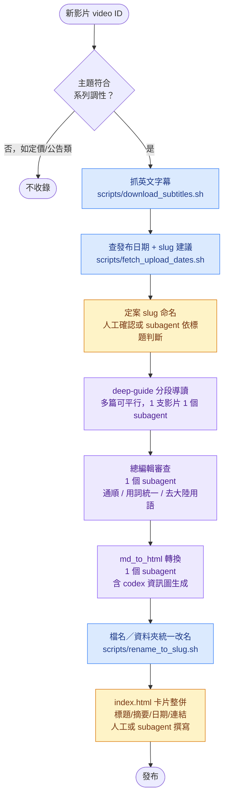

# Matt Pocock AI 工作流精選導讀

**別再滑走那些「AI 幫我寫程式碼」的影片標題了——你需要的不是更多資訊，是有人幫你消化。**

Matt Pocock 這兩三個月幾乎每週都在丟乾貨：/prototype、/handoff、/grill-me、/triage……一堆你來不及點開的技能名稱，堆成了一座沒人有空爬的知識山。

這個專案做了一件事：**把 13 支影片，各自拆解成一篇你 10 分鐘就能看懂、看完還會想動手試的深度導讀。**

不是逐字翻譯，不是重點條列的懶人包。每一篇都重新想過「這支影片到底想解決什麼問題」，配上 AI 生成的資訊圖把抽象概念畫成一眼看懂的圖，全程台灣 IT 圈習慣的講法，不是機器翻譯腔。

從「別把時間浪費在寫規格書上」到「AI agent 開始自己排班怎麼辦」，你不用照順序看，挑一篇你現在正卡住的問題，直接點進去。

📖 **13 篇導讀，一個總目錄，看到哪篇算哪篇。**
🔗 https://lushinshang.github.io/mattpocock_yt/

---

把 Matt Pocock YouTube 頻道上「AI 輔助程式開發工作流」主題的影片，轉成繁體中文台灣用語的深度導讀網站。每支影片都會產出一篇獨立的深度導讀 HTML（含 AI 生成資訊圖），並用一個總目錄頁 `index.html` 串起來。

給誰看：上面這段是給讀者看的專案介紹；這份 README 其餘部分是給「未來要新增影片、或重跑整條 pipeline」的人（不論是使用者自己，還是接手的 AI session）看的操作說明，不是給讀者看的內容頁。

## 目錄結構

```
mattpocockuk/
├── index.html              # 總目錄頁
├── guides/                 # 13 篇深度導讀 HTML + 資訊圖
│   ├── <slug>.html
│   └── images/<slug>/      # 每篇的 16:9 / 9:16 資訊圖、截圖 QA
├── guides_md/               # 深度導讀的 Markdown 定稿（html 的來源）
├── subtitles/
│   └── en/<slug>.srt        # 英文原始字幕（yt-dlp 抓的自動字幕，deep-guide 直接依此撰寫）
├── scripts/                 # 這次新增的工程化腳本（見下方）
└── sdd/                      # 這個專案的提案/任務/歸檔紀錄
```

## Pipeline 全貌



藍色＝腳本（工程化、確定性高，不需要語言判斷）；紫色＝subagent（需要語意/內容判斷，不能規則化）；黃色＝人工判斷（目前沒有自動化，靠人看）。

### 為什麼有些步驟不工程化

- **主題篩選**（要不要收錄）：靠人判斷影片是不是「AI 輔助程式開發工作流」主題。實際案例：`lNOQaakmyDU`（Anthropic 定價調整）雖然發布時間卡在既有文章之間，但主題不合，被排除。這件事沒辦法寫成關鍵字規則，太容易誤判。
- **deep-guide 分段導讀 / 總編輯審查 / md_to_html 排版判斷**：這三步都需要理解文章語意（怎麼分段、怎麼寫得流暢、哪裡該放資訊圖），是這個 pipeline 的核心價值所在，本來就该由 AI 判斷完成，不是「還沒工程化」而是「本質上不該工程化」。
- **index.html 卡片摘要撰寫**：目前是人工／subagent 手動寫一句話摘要，因為要精準又不能太長，機械式截取文章開頭效果不好。

## 工程化腳本

### `scripts/download_subtitles.sh`

抓一批影片的英文字幕，存到 `subtitles/en/<id>.srt`。已存在的檔案會跳過，不會覆蓋。

```bash
scripts/download_subtitles.sh <video_id> [video_id ...]
scripts/download_subtitles.sh -f id_list.txt   # 每行一個 video id
```

背後用 `yt-dlp --write-sub --write-auto-sub --sub-lang en --sub-format srt`。這 13 支影片實測過，**全部都沒有創作者手動字幕，只有 YouTube 自動語音辨識字幕**，所以品質會受限於 ASR 準確度（標點、專有名詞、斷句可能不準）。

### `scripts/fetch_upload_dates.sh`

查一批影片的發布日期與標題，輸出 CSV，供填 `index.html` 卡片日期、以及提供 slug 命名的起點建議。

```bash
scripts/fetch_upload_dates.sh <video_id> [video_id ...]
scripts/fetch_upload_dates.sh -f id_list.txt
# 輸出：video_id,upload_date,naive_slug,title
```

`naive_slug` 只是把英文標題機械式轉成 kebab-case，當作起點参考——最終 slug 應該對照 deep-guide 實際下的中文標題來取（例如標題若是「AI 沒有讓程式碼變爛」而非原文的「How To De-Slop...」，slug 選 `ai-deslop-codebase` 比機械翻譯原標題更貼切），這一步需要語意判斷，腳本不代勞。

### `scripts/rename_to_slug.sh`

給一份 `id:slug` 對照表，把 `guides_md/`、`guides/images/`、`subtitles/en/` 底下用 video ID 命名的檔案／資料夾，統一改成 slug 命名（腳本本身仍相容 `subtitles/zh-TW/`，只是目前的 SOP 不再產生這份檔案）。

```bash
scripts/rename_to_slug.sh id_slug_map.txt
# id_slug_map.txt 內容範例：
# n0VhIVtviC0:prototype-not-specs
# 3MP8D-mdheA:ai-deslop-codebase
```

冪等：如果來源檔已經不在、但目標檔已存在，視為「已經改過名」，跳過不報錯，可以重複執行。

**這支腳本不會**自動修正 `guides/<slug>.html` 內的圖片路徑、也不會改 `index.html` 的連結——因為改名當下這兩份檔案可能還沒產生。跑完會印出「還需要人工/subagent 同步」的清單，提醒後續步驟要處理。

## 新增一支影片：完整 SOP

1. 判斷主題是否符合系列調性（人工看一眼標題/簡介，不確定就看一下影片）。不符合就停在這一步，不用往下做。
2. `scripts/download_subtitles.sh <id>` 抓英文字幕
3. `scripts/fetch_upload_dates.sh <id>` 拿到發布日期與 slug 建議
4. 對照 deep-guide 之後會下的中文標題，定案最終 slug（如果還沒寫 deep-guide，可以先用 naive_slug 暫代，之後視需要再跑一次改名）
5. 派 1 個 subagent：讀 `subtitles/en/<slug>.srt`，先分段再依 `deep-guide` skill 規範寫深度導讀，輸出 `guides_md/<slug>.md`
6. 派 1 個 subagent 扮演總編輯，審查 `guides_md/<slug>.md`：通順、用詞統一、台灣用語、去大陸用語
7. 派 1 個 subagent 依 `md_to_html` skill 規範，把 `guides_md/<slug>.md` 轉成 `guides/<slug>.html`（含 codex 資訊圖生成，需要先確認 `codex` CLI 已登入）
8. 如果步驟 4 用的是暫代 slug、跟最終定案不同，跑 `scripts/rename_to_slug.sh` 統一改名，並手動修正 `guides/<slug>.html` 內的圖片路徑
9. 在 `index.html` 新增一張卡片：中文標題、一句話摘要、發布日期（步驟 3 已拿到）、`guides/<slug>.html` 連結、YouTube 連結（用原始 video ID，不是 slug）
10. 驗證：`python3 -m html.parser guides/<slug>.html` 語法檢查、確認 `index.html` 連結都指得到真實檔案

## 執行歷程

這一節採倒序記錄。後續每新增或重跑一支影片，請在最上方追加一筆，至少保留日期、video ID、slug、主要產出與驗證結果，讓下一個 AI session 不必重新推測先前做過哪些事。

### 2026-07-31：新增 Wayfinder 大型專案規劃

**來源與收錄判斷**

- Video ID：`F3lL98Pj90o`
- 原始標題：`/wayfinder: Nothing is too big to plan anymore`
- YouTube 發布日期：2026-07-30
- 處理當時觀看數：79,638（首頁顯示為 `80K views`）
- 片長：15:09
- 收錄理由：內容直接示範如何用 Wayfinder 跨多個 agent session 管理研究、原型、盤問、外部任務、決策依賴及後續規格／實作票，明確符合「AI 輔助程式開發工作流」主題。
- 最終 slug：`wayfinder-project-planning`

**字幕與內容處理**

- 透過 `scripts/download_subtitles.sh F3lL98Pj90o` 下載 YouTube 英文自動字幕。
- 英文字幕定稿位置：`subtitles/en/wayfinder-project-planning.srt`
- 本次沒有另外產生 `subtitles/zh-TW/` 字幕；深度導讀直接依英文自動字幕撰寫，符合目前 SOP 第 2–5 步的做法。
- 依 `deep-guide` skill 撰寫並總編輯審查：
  - `guides_md/wayfinder-project-planning.md`
  - 中文標題：〈不是把大專案切小就好：Wayfinder 真正管理的是「現在還不能決定的事」〉
- 文章重點包括 Frontier／Fog、四種決策票、阻塞關係、外部化決策紀錄、決策票與實作票的區別，以及何時不應使用 Wayfinder。
- 執行 `normalize_punctuation.py` 檢查台灣繁體中文標點，結果為 0 處需要修正；另檢查簡體／中國用語與 deep-guide 禁用詞，未發現問題。

**資訊圖與 HTML**

- 使用內建 ImageGen 產生兩組資訊圖，每組都有桌機 `16:9` 與手機 `9:16` 版本：
  - `guides/images/wayfinder-project-planning/section_1.png`
  - `guides/images/wayfinder-project-planning/section_1-mobile.png`
  - `guides/images/wayfinder-project-planning/section_2.png`
  - `guides/images/wayfinder-project-planning/section_2-mobile.png`
- 第一組呈現 Frontier、Fog、決策阻塞與逐步解除阻塞；第二組比較 Research、Prototype、Grilling、Task 四種決策票。
- 新增可重跑的建置腳本：`scripts/build_wayfinder_guide.py`
- 發布頁：`guides/wayfinder-project-planning.html`
- HTML 依 `md-to-phtml` skill 製作，包含響應式 `<picture>`、手機圖片切換、橫向捲動段落導覽與 `currentSrc` lightbox。

**首頁與文件同步**

- 在 `index.html` 最前方加入第 13 篇卡片，原有卡片依序改編為 `#02` 至 `#13`。
- 首頁統計同步改成 13 部影片／13 篇導讀，時間範圍由近兩個月更新為近三個月。
- README 內固定寫死的 12 篇／12 支影片同步更新為 13，其他會持續變動的描述改為不綁數量。

**QA 結果**

- `python3 -m html.parser`：新導讀頁與 `index.html` 均通過。
- 首頁實際偵測到 13 張卡片，編號由 `#01` 至 `#13` 連續，沒有失效的本機連結。
- 桌機 `1440 × 1100`：載入 `section_1.png`／`section_2.png`，無水平溢位。
- 手機 `390 × 844`：正確改載入兩張 `-mobile.png`，無水平溢位。
- Lightbox：點擊可開啟、使用目前 viewport 的 `currentSrc`、按 `Esc` 可關閉。
- QA 截圖：
  - `guides/images/wayfinder-project-planning/qa_desktop.png`
  - `guides/images/wayfinder-project-planning/qa_mobile.png`

## 已知限制

- Codex 資訊圖生成需要 `codex` CLI 先 `codex login`，且每張圖 1–5 分鐘，全套跑下來是數小時量級的工作。
- yt-dlp 抓到的字幕品質取決於 YouTube 自動字幕的辨識準確度，這個專案目前沒有針對辨識錯誤做額外校正，翻譯與導讀階段是直接基於這份字幕內容工作。
- `index.html` 卡片摘要與標題目前沒有自動同步機制——如果之後又重寫了某篇 `guides_md/*.md`，`index.html` 的卡片文字不會自動更新，需要手動比對。
